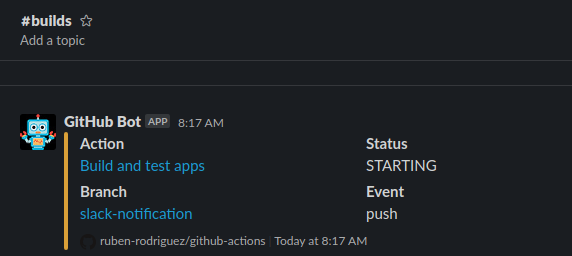
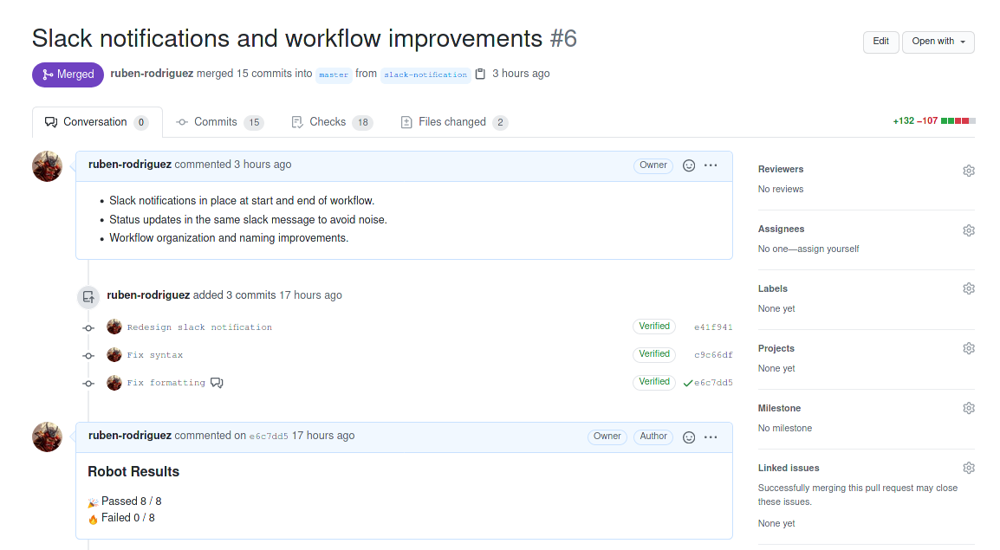
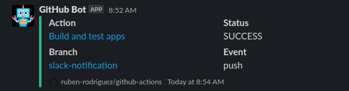
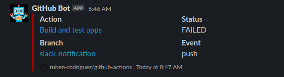
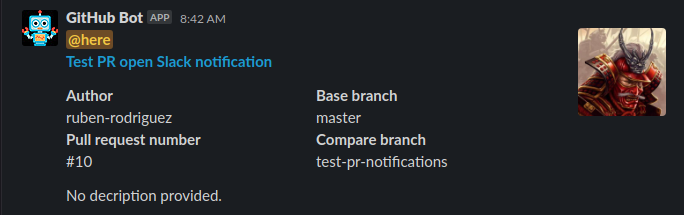

## github-actions

This repository contains some sample apps and associated test suites written in different languages (Java, Go and Python), organized in folders.
The purpose is quite simple: test and discover GitHub Actions workflow features, capabilities and potential limitations.
Please note this is still a work in progress exercise, hence might contain some errors and other hiccups, and is subject to change.

### Repository structure:

```txt
.
├── .github/workflows: GitHub actions workflow.
├── .gitsecret: git secret related config files.
├── app: Python demo web application used for robot framework testing.
│   └── html: web application resources.
├── go-apps: go simple apps to build and test.
│   ├── hello: Hello World Go application and test suite.
│   ├── hello2: Clone of previous Hello World Go application and test suite.
├── java-apps: java simple spring apps and tests; each app loads different env variables from .env file.
│   ├── HelloWorld: Hello World Java application and test suite.
│   └── test: Clone of previous Hello World Java. application and test suite.
├── robot-tests : Robot Framework sample tests for the Python Webapp Demo.
├── secrets: secrets obscured.
└── *.env: environment files
```

### Main Workflow Description

The defined main workflow  ```java-go-python.yaml``` (there is a side workflow for Slack notifications on PRs) will be triggered when push or pull request events are fired on any branch:

```yaml
name: Build and test apps

on: [push, pull_request]
```

It contains the following jobs (summary):

- **slack-notify-start**: sends a notification to **#builds** slack channel when workflow starts:



- **java**: leverages matrix strategy to build and test all java apps organized in different folders. It executes mvn commands and reveals git secrets.

- **go**: leverages matrix strategy to build and test all go apps organized in different folders. It executes go commands.

- **python**: runs and test Python demo WebApp using Robot Framework. It uploads Robot Framework reports to ```/reports``` folder created at workflow execution time.

- **check**: this job is always executed regardless other jobs' finish status. It checks that the core jobs (go, java, python) finish correctly without errors. It is then required by branch policy to merge pull requests.

- **generate_report**: fetches Robot Framework results from ```/reports``` folder and appends the results to commit message:



- **slack-notify-end:** this job is always executed and checks the **check** job to update the slack notification previously sent appropriately (success or failure):





### Slack PR notification Workflow Description

This workflow is used to notify on PR open and reopen events:

```yaml
on:
  pull_request:
    types: [opened, reopened]
```



### GitHub Actions features leveraged by this workflow

- Job status verification: 

```yaml
if: ${{ success() }}
```

- Job and steps outputs and ids:

```yaml
outputs:
      msgid: ${{ steps.slack.outputs.message_id }}
steps:
      id: slack #
...
with:
      message_id: ${{ needs.slack-notify-start.outputs.msgid }}
```

- Matrix strategy to execute jobs for every repository folder:

```yaml
 strategy:
      matrix:
        javaApps: [java-apps/test, java-apps/HelloWorld]
   defaults:
      run:
        working-directory: ${{ matrix.javaApps }}
```

- Execution of commands directly, for loading env variables, for example:

```yaml
run: |
   export $(grep -v '#.*' .env | xargs)
   echo $TEST
```

- Job dependency and status check:

```yaml
check:
   if: ${{ always() }}
   runs-on: ubuntu-latest
   name: Check success
   needs: [go, java, python]
steps:
   - name: Check build matrix go status
     if: ${{ needs.go.result != 'success' }}
     run: exit 1
```

### Workflow Further Improvements

- Skip checks on docs changes, feature branches: [Skip Duplicate Actions](https://github.com/fkirc/skip-duplicate-actions)
- Skip jobs based on branch names,  example:

```yaml
on:
  # Trigger the workflow on push or pull request,
  # but only for the master branch
  push:
    branches:
      - master
  pull_request:
    branches:
      - master
```

### GitHub Actions Limitations (might not be such)

- Does not support preventing parallel runs: [Prevent parallel workflows? - GitHub Actions - GitHub Support Community](https://github.community/t/prevent-parallel-workflows/16370)

### Used Actions

- [actions/checkout: Action for checking out a repo](https://github.com/actions/checkout)

- [actions/setup-java: Set up your GitHub Actions workflow with a specific version of Java](https://github.com/actions/setup-java)

- [actions/setup-go: Set up your GitHub Actions workflow with a specific version of Go](https://github.com/actions/setup-go)

- [actions/setup-python: Set up your GitHub Actions workflow with a specific version of python](https://github.com/actions/setup-python)

- [actions/upload-artifact](https://github.com/actions/upload-artifact)

- [actions/download-artifact](https://github.com/actions/download-artifact)

- [joonvena/robotframework-reporter-action: This action can be used to send parsed test report as comment to that commit that triggered test run](https://github.com/joonvena/robotframework-reporter-action)

- [voxmedia/github-action-slack-notify-build: Report GitHub Actions build status on Slack](https://github.com/voxmedia/github-action-slack-notify-build)

- [jun3453/slack-pr-open-notification-action: Use github actions to notify slack that a pull request has been opened.](https://github.com/jun3453/slack-pr-open-notification-action)

### References

- [GitHub Actions - GitHub Docs](https://docs.github.com/es/free-pro-team@latest/actions)

- [GitHub Actions Job outputs](https://stackoverflow.com/questions/59175332/using-output-from-a-previous-job-in-a-new-one-in-a-github-action)

- [Robot Framework WebDemo](https://github.com/robotframework/WebDemo)

- [Robot Docker Demo workflow](https://github.com/laojala/robot_docker_demo)